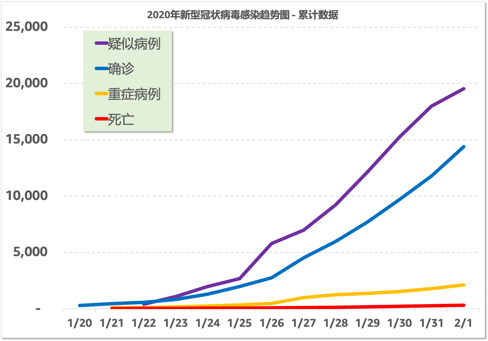
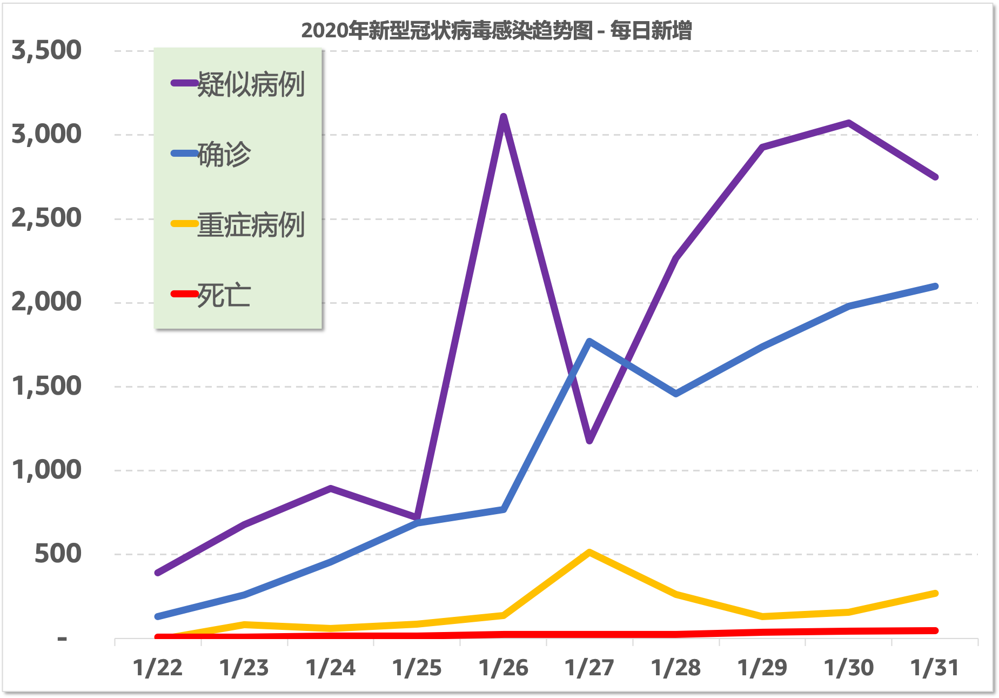
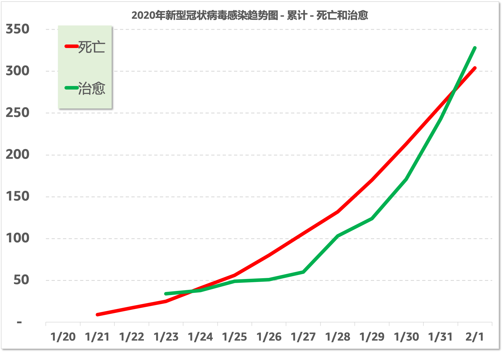

# 2020年新型冠状病毒感染趋势图

## 说明

这是根据卫建委发布的官方数据制作的每日疫情发展趋势图。每日830~930之间根据卫建委发布的最新疫情通报更新。

- 更新时间: **`10:00, 2/1/2020`**
- [网页地址](https://zire.github.io/pandemic2020/)
- [Github Repo地址](https://github.com/zire/pandemic2020)
- 数据来源：[中华人民共和国国家卫生健康委员会卫生应急办公室](http://www.nhc.gov.cn/)
- 数据范围: 全中国
- 数据统计窗口：每日00 - 24小时
- 死亡率 = 当日死亡人数/当日确诊人数

## 疫情趋势图

历史累计

每日新增

历史累计 - 死亡和治愈

## 统计数据

### 累计

| 日期 | 密切接触 | 接受医学观察 | 疑似病例 | 确诊 | 重症病例 | 死亡 | 治愈|
| --- | --- | --- | --- | --- | --- | --- | --- |
|1/31/2020|136,987|118,478|17,988|11,791|1,795|259|243|
|1/30/2020|113,579|102,427|15,238|9,692|1,527|213|171|
|1/29/2020|88,693|81,947|12,167|7,711|1,370|170|124|
|1/28/2020|65,537|59,990|9,239|5,974|1,239|132|103|
|1/27/2020|47,833|44,132|6,973|4,515|976|106|60|
|1/26/2020|32,799|30,453|5,794|2,744|461|80|51|
|1/25/2020 | 23,431 | 21,556| 2,684|1,975| 324|56|49|
|1/24/2020|15,197|13,967|1,965|1,287|237|41|38|
|1/23/2020|9,507|8,420|1,072|830|177|25|34|
|1/22/2020|5,897|4,928|393|571|95|17|N.A.|
|1/21/2020|2,197| 1,394| N.A. |440|102|9|N.A.|
|1/20/2020|1,739|922|54|291|N.A.|N.A.|N.A.|

### 当日新增百分比

| 日期 | 密切接触 | 接受医学观察 | 疑似病例 | 确诊 | 重症病例 | 死亡 | 治愈 |死亡率|
| --- | --- | --- | --- | --- | --- | --- | ---| --- |
|1/30/2020|28%|25%|25%|26%|11%|25%|38%|2.20%|
|1/29/2020|35%|37%|32%|29%|11%|29%|20%|2.20%|
|1/28/2020|37%|36%|32%|32%|27%|25%|72%|2.21%|
|1/27/2020|46%|45%|20%|65%|112%|33%|18%|2.35%|
|1/26/2020|40%|41%|116%|39%|42%|43%|4%|2.92%|
|1/25/2020|54%|54%|37%|53%|37%|37%|29%|2.84%|
|1/24/2020|60%|66%|83%|55%|34%|64%|12%|3.19%|
|1/23/2020|61%|71%|173%|45%|86%|47%|N.A.|3.01%|
|1/22/2020|168%|254%|N.A.|30%|-7%|89%|N.A.|2.98%|
|1/21/2020|26%| 51%| N.A. |N.A.|N.A.|N.A.|N.A.|N.A.|

## 测算 

###  确诊数量

- Latest date as BOP (Beginning of Period): *`1/31/2020`*
- Latest average day-over-day % of the last 3 trailing days: *`25.5%`*

| # of Days from 1/31 | -20% Adj | -10% Adj | 0% Adj | 10% Adj | 20% Adj |
| ---: |---: |---: |---: |---: |---:|
| | 20.4% |22.9%| 25.5%| 28.0%| 30.6%|
|7 | 43,194| 50,013|57,735|66,457|76,285|
|14|158,231|212,137|282,702|374,571|493,551| 
|21|579,647|899,808|1,384,261|2,111,186|3,193,178| 
|28|2,123,413|3,816,652|6,778,089|11,899,221|20,659,222|

### 死亡数量

- Latest date as BOP (Beginning of Period): *`1/31/2020`*
- Latest average day-over-day % of the last 3 trailing days: *`25.2%`*

| # of Days from 1/31 | -20% Adj | -10% Adj | 0% Adj | 10% Adj | 20% Adj |
| ---: |---: |---: |---: |---: |---:|
|7|	 938| 	 1,085| 	 1,251| 	 1,438| 	 1,649| 
|14|	 3,396|4,543 	 |6,040 	 |7,985| 	 10,500 
|21|	 12,298| 	 19,024| 	 29,167| 	 44,339| 66,853| 
|28|	 44,534| 	 79,669| 	 140,849| 	 246,196| 425,661| 

## 数据来源

- [截至1月31日24时新型冠状病毒感染的肺炎疫情最新情况](http://www.nhc.gov.cn/xcs/yqfkdt/202002/84faf71e096446fdb1ae44939ba5c528.shtml)
- [截至1月30日24时新型冠状病毒感染的肺炎疫情最新情况](http://www.nhc.gov.cn/xcs/yqtb/202001/a53e6df293cc4ff0b5a16ddf7b6b2b31.shtml)
- [截至1月29日24时新型冠状病毒感染的肺炎疫情最新情况](http://www.nhc.gov.cn/xcs/yqtb/202001/e71bd2e7a0824ca69f87bbf1bef2a3c9.shtml)
- [截至1月28日24时新型冠状病毒感染的肺炎疫情最新情况](http://www.nhc.gov.cn/xcs/yqtb/202001/1c259a68d81d40abb939a0781c1fe237.shtml)
- [截至1月27日24时新型冠状病毒感染的肺炎疫情最新情况](http://www.nhc.gov.cn/xcs/yqtb/202001/ec9fe7ea987d467d9462e7db509079e6.shtml)
- [截至1月26日24时新型冠状病毒感染的肺炎疫情最新情况](http://www.nhc.gov.cn/xcs/yqtb/202001/3882fdcdbfdc4b4fa4e3a829b62d518e.shtml)
- [截至1月25日24时新型冠状病毒感染的肺炎疫情最新情况](http://www.nhc.gov.cn/xcs/yqtb/202001/9614b05a8cac4ffabac10c4502fe517c.shtml)
- [截至1月24日24时新型冠状病毒感染的肺炎疫情最新情况](http://www.nhc.gov.cn/xcs/yqtb/202001/a7cf0437d1324aed9cc1b890b8ee29e6.shtml)
- [1月23日新型冠状病毒感染的肺炎疫情情况](http://www.nhc.gov.cn/xcs/yqtb/202001/5d19a4f6d3154b9fae328918ed2e3c8a.shtml)
- [1月22日新型冠状病毒感染的肺炎疫情情况](http://www.nhc.gov.cn/xcs/yqtb/202001/a3c8b5144067417889d8760254b1a7ca.shtml)
- [1月21日新型冠状病毒感染的肺炎疫情情况](http://www.nhc.gov.cn/xcs/yqtb/202001/930c021cdd1f46dc832fc27e0cc465c8.shtml)