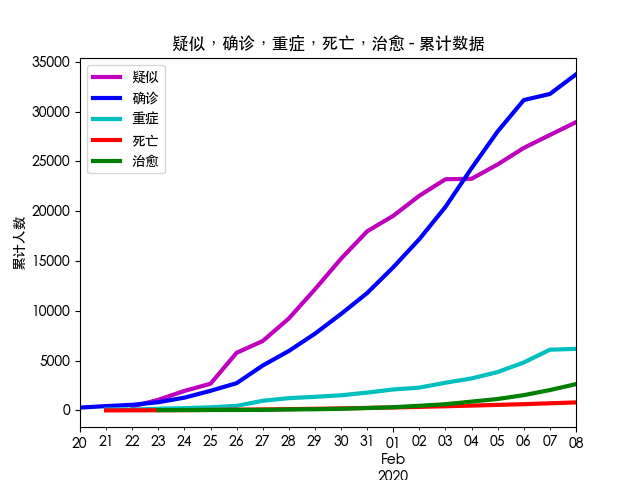
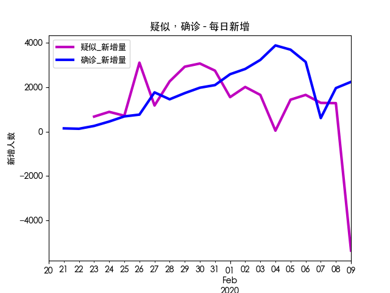
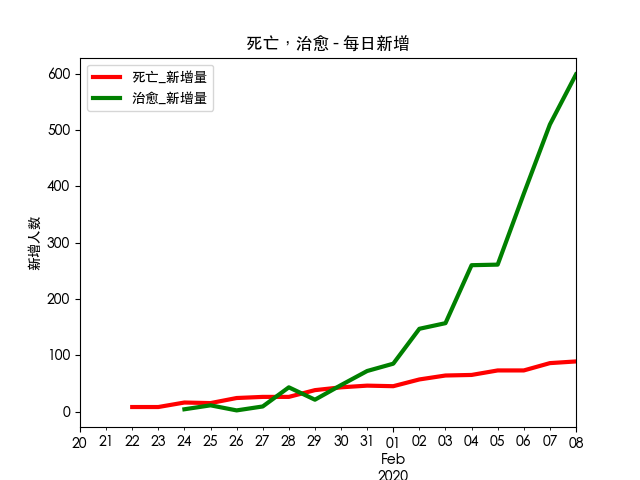

# 2020年新型冠状病毒感染趋势图

## 说明

这是根据卫建委发布的官方数据制作的每日疫情发展趋势图。每日830~930之间根据卫建委发布的最新疫情通报更新。

- 更新时间: **`08:30, 02-09`**
- [网页地址](https://zire.github.io/pandemic2020/)
- [Github Repo地址](https://github.com/zire/pandemic2020)
- 数据来源：[中华人民共和国国家卫生健康委员会卫生应急办公室](http://www.nhc.gov.cn/)
- 数据范围: 全中国
- 数据统计窗口：每日00 - 24小时
- 死亡率 = 当日累计死亡人数/当日累计确诊人数

## 疫情趋势图

疑似，确诊，重症，死亡，治愈 - 历史累计

疑似，确诊 - 每日新增

死亡，治愈 - 每日新增

## 统计数据

### 累计

|    |                                                                                               日期 |    接触 |    观察 |   疑似 |   确诊 |   重症 |   死亡 |   治愈 |
|---:|---------------------------------------------------------------------------------------------------:|--------:|--------:|-------:|-------:|-------:|-------:|-------:|
| 19 |   <a href='http://www.nhc.gov.cn/xcs/yqtb/202002/4f28ab5ca87d42d284833df3ccc8d45a.shtml'>02/08</a> | 371,905 | 188,183 | 28,942 | 33,738 |  6,188 |    811 |  2,649 |
| 18 |   <a href='http://www.nhc.gov.cn/xcs/yqtb/202002/6c305f6d70f545d59548ba17d79b8229.shtml'>02/07</a> | 345,498 | 189,660 | 27,657 | 31,774 |  6,101 |    722 |  2,050 |
| 17 |   <a href='http://www.nhc.gov.cn/xcs/yqtb/202002/3db09278e3034f289841300ed09bd0e1.shtml'>02/06</a> | 314,028 | 186,045 | 26,359 | 31,161 |  4,821 |    636 |  1,540 |
| 16 |   <a href='http://www.nhc.gov.cn/xcs/yqtb/202002/6b1e029fd22c484281cbc5e73dae98fc.shtml'>02/05</a> | 282,813 | 186,345 | 24,702 | 28,018 |  3,859 |    563 |  1,153 |
| 15 |   <a href='http://www.nhc.gov.cn/xcs/yqtb/202002/17a03704a99646ffad6807bc806f37a4.shtml'>02/04</a> | 252,154 | 185,555 | 23,260 | 24,324 |  3,219 |    490 |    892 |
| 14 |   <a href='http://www.nhc.gov.cn/xcs/yqtb/202002/bfebf84fb88248e4a4eba61295e5882b.shtml'>02/03</a> | 221,015 | 171,329 | 23,214 | 20,438 |  2,788 |    425 |    632 |
| 13 |   <a href='http://www.nhc.gov.cn/xcs/yqtb/202002/24a796819bf747bd8b945384517e9a51.shtml'>02/02</a> | 189,583 | 152,700 | 21,558 | 17,205 |  2,296 |    361 |    475 |
| 12 | <a href='http://www.nhc.gov.cn/xcs/yqfkdt/202002/24a796819bf747bd8b945384517e9a51.shtml'>02/01</a> | 163,844 | 137,594 | 19,544 | 14,380 |  2,110 |    304 |    328 |
| 11 |   <a href='http://www.nhc.gov.cn/xcs/yqtb/202002/d5c495da742f4739b7f99339c3bd032f.shtml'>01/31</a> | 136,987 | 118,478 | 17,988 | 11,791 |  1,795 |    259 |    243 |
| 10 |   <a href='http://www.nhc.gov.cn/xcs/yqtb/202002/84faf71e096446fdb1ae44939ba5c528.shtml'>01/30</a> | 113,579 | 102,427 | 15,238 |  9,692 |  1,527 |    213 |    171 |
|  9 |   <a href='http://www.nhc.gov.cn/xcs/yqtb/202001/a53e6df293cc4ff0b5a16ddf7b6b2b31.shtml'>01/29</a> |  88,693 |  81,947 | 12,167 |  7,711 |  1,370 |    170 |    124 |
|  8 |   <a href='http://www.nhc.gov.cn/xcs/yqtb/202001/e71bd2e7a0824ca69f87bbf1bef2a3c9.shtml'>01/28</a> |  65,537 |  59,990 |  9,239 |  5,974 |  1,239 |    132 |    103 |
|  7 |   <a href='http://www.nhc.gov.cn/xcs/yqtb/202001/1c259a68d81d40abb939a0781c1fe237.shtml'>01/27</a> |  47,833 |  44,132 |  6,973 |  4,515 |    976 |    106 |     60 |
|  6 |   <a href='http://www.nhc.gov.cn/xcs/yqtb/202001/ec9fe7ea987d467d9462e7db509079e6.shtml'>01/26</a> |  32,799 |  30,453 |  5,794 |  2,744 |    461 |     80 |     51 |
|  5 |   <a href='http://www.nhc.gov.cn/xcs/yqtb/202001/3882fdcdbfdc4b4fa4e3a829b62d518e.shtml'>01/25</a> |  23,431 |  21,556 |  2,684 |  1,975 |    324 |     56 |     49 |
|  4 |   <a href='http://www.nhc.gov.cn/xcs/yqtb/202001/9614b05a8cac4ffabac10c4502fe517c.shtml'>01/24</a> |  15,197 |  13,967 |  1,965 |  1,287 |    237 |     41 |     38 |
|  3 |   <a href='http://www.nhc.gov.cn/xcs/yqtb/202001/a7cf0437d1324aed9cc1b890b8ee29e6.shtml'>01/23</a> |   9,507 |   8,420 |  1,072 |    830 |    177 |     25 |     34 |
|  2 |   <a href='http://www.nhc.gov.cn/xcs/yqtb/202001/5d19a4f6d3154b9fae328918ed2e3c8a.shtml'>01/22</a> |   5,897 |   4,928 |    393 |    571 |     95 |     17 |    nan |
|  1 |   <a href='http://www.nhc.gov.cn/xcs/yqtb/202001/a3c8b5144067417889d8760254b1a7ca.shtml'>01/21</a> |   2,197 |   1,394 |    nan |    440 |    102 |      9 |    nan |
|  0 |   <a href='http://www.nhc.gov.cn/xcs/yqtb/202001/930c021cdd1f46dc832fc27e0cc465c8.shtml'>01/20</a> |   1,739 |     922 |     54 |    291 |    nan |    nan |    nan |

### 当日新增

|    |                                                                                               日期 |   接触 |   观察 |   疑似 |   确诊 |   重症 |   死亡 |   治愈 |
|---:|---------------------------------------------------------------------------------------------------:|-------:|-------:|-------:|-------:|-------:|-------:|-------:|
| 19 |   <a href='http://www.nhc.gov.cn/xcs/yqtb/202002/4f28ab5ca87d42d284833df3ccc8d45a.shtml'>02/08</a> | 26,407 | -1,477 |  1,285 |  1,964 |     87 |     89 |    599 |
| 18 |   <a href='http://www.nhc.gov.cn/xcs/yqtb/202002/6c305f6d70f545d59548ba17d79b8229.shtml'>02/07</a> | 31,470 |  3,615 |  1,298 |    613 |  1,280 |     86 |    510 |
| 17 |   <a href='http://www.nhc.gov.cn/xcs/yqtb/202002/3db09278e3034f289841300ed09bd0e1.shtml'>02/06</a> | 31,215 |   -300 |  1,657 |  3,143 |    962 |     73 |    387 |
| 16 |   <a href='http://www.nhc.gov.cn/xcs/yqtb/202002/6b1e029fd22c484281cbc5e73dae98fc.shtml'>02/05</a> | 30,659 |    790 |  1,442 |  3,694 |    640 |     73 |    261 |
| 15 |   <a href='http://www.nhc.gov.cn/xcs/yqtb/202002/17a03704a99646ffad6807bc806f37a4.shtml'>02/04</a> | 31,139 | 14,226 |     46 |  3,886 |    431 |     65 |    260 |
| 14 |   <a href='http://www.nhc.gov.cn/xcs/yqtb/202002/bfebf84fb88248e4a4eba61295e5882b.shtml'>02/03</a> | 31,432 | 18,629 |  1,656 |  3,233 |    492 |     64 |    157 |
| 13 |   <a href='http://www.nhc.gov.cn/xcs/yqtb/202002/24a796819bf747bd8b945384517e9a51.shtml'>02/02</a> | 25,739 | 15,106 |  2,014 |  2,825 |    186 |     57 |    147 |
| 12 | <a href='http://www.nhc.gov.cn/xcs/yqfkdt/202002/24a796819bf747bd8b945384517e9a51.shtml'>02/01</a> | 26,857 | 19,116 |  1,556 |  2,589 |    315 |     45 |     85 |
| 11 |   <a href='http://www.nhc.gov.cn/xcs/yqtb/202002/d5c495da742f4739b7f99339c3bd032f.shtml'>01/31</a> | 23,408 | 16,051 |  2,750 |  2,099 |    268 |     46 |     72 |
| 10 |   <a href='http://www.nhc.gov.cn/xcs/yqtb/202002/84faf71e096446fdb1ae44939ba5c528.shtml'>01/30</a> | 24,886 | 20,480 |  3,071 |  1,981 |    157 |     43 |     47 |
|  9 |   <a href='http://www.nhc.gov.cn/xcs/yqtb/202001/a53e6df293cc4ff0b5a16ddf7b6b2b31.shtml'>01/29</a> | 23,156 | 21,957 |  2,928 |  1,737 |    131 |     38 |     21 |
|  8 |   <a href='http://www.nhc.gov.cn/xcs/yqtb/202001/e71bd2e7a0824ca69f87bbf1bef2a3c9.shtml'>01/28</a> | 17,704 | 15,858 |  2,266 |  1,459 |    263 |     26 |     43 |
|  7 |   <a href='http://www.nhc.gov.cn/xcs/yqtb/202001/1c259a68d81d40abb939a0781c1fe237.shtml'>01/27</a> | 15,034 | 13,679 |  1,179 |  1,771 |    515 |     26 |      9 |
|  6 |   <a href='http://www.nhc.gov.cn/xcs/yqtb/202001/ec9fe7ea987d467d9462e7db509079e6.shtml'>01/26</a> |  9,368 |  8,897 |  3,110 |    769 |    137 |     24 |      2 |
|  5 |   <a href='http://www.nhc.gov.cn/xcs/yqtb/202001/3882fdcdbfdc4b4fa4e3a829b62d518e.shtml'>01/25</a> |  8,234 |  7,589 |    719 |    688 |     87 |     15 |     11 |
|  4 |   <a href='http://www.nhc.gov.cn/xcs/yqtb/202001/9614b05a8cac4ffabac10c4502fe517c.shtml'>01/24</a> |  5,690 |  5,547 |    893 |    457 |     60 |     16 |      4 |
|  3 |   <a href='http://www.nhc.gov.cn/xcs/yqtb/202001/a7cf0437d1324aed9cc1b890b8ee29e6.shtml'>01/23</a> |  3,610 |  3,492 |    679 |    259 |     82 |      8 |    nan |
|  2 |   <a href='http://www.nhc.gov.cn/xcs/yqtb/202001/5d19a4f6d3154b9fae328918ed2e3c8a.shtml'>01/22</a> |  3,700 |  3,534 |    nan |    131 |     -7 |      8 |    nan |
|  1 |   <a href='http://www.nhc.gov.cn/xcs/yqtb/202001/a3c8b5144067417889d8760254b1a7ca.shtml'>01/21</a> |    458 |    472 |    nan |    149 |    nan |    nan |    nan |
|  0 |   <a href='http://www.nhc.gov.cn/xcs/yqtb/202001/930c021cdd1f46dc832fc27e0cc465c8.shtml'>01/20</a> |    nan |    nan |    nan |    nan |    nan |    nan |    nan |

### 当日新增百分比

|    |                                                                                               日期 |   接触 |   观察 |   疑似 |   确诊 |   重症 |   死亡 |   治愈 |
|---:|---------------------------------------------------------------------------------------------------:|-------:|-------:|-------:|-------:|-------:|-------:|-------:|
| 19 |   <a href='http://www.nhc.gov.cn/xcs/yqtb/202002/4f28ab5ca87d42d284833df3ccc8d45a.shtml'>02/08</a> |   7.6% |  -0.8% |   4.6% |   6.2% |   1.4% |  12.3% |  29.2% |
| 18 |   <a href='http://www.nhc.gov.cn/xcs/yqtb/202002/6c305f6d70f545d59548ba17d79b8229.shtml'>02/07</a> |  10.0% |   1.9% |   4.9% |   2.0% |  26.6% |  13.5% |  33.1% |
| 17 |   <a href='http://www.nhc.gov.cn/xcs/yqtb/202002/3db09278e3034f289841300ed09bd0e1.shtml'>02/06</a> |  11.0% |  -0.2% |   6.7% |  11.2% |  24.9% |  13.0% |  33.6% |
| 16 |   <a href='http://www.nhc.gov.cn/xcs/yqtb/202002/6b1e029fd22c484281cbc5e73dae98fc.shtml'>02/05</a> |  12.2% |   0.4% |   6.2% |  15.2% |  19.9% |  14.9% |  29.3% |
| 15 |   <a href='http://www.nhc.gov.cn/xcs/yqtb/202002/17a03704a99646ffad6807bc806f37a4.shtml'>02/04</a> |  14.1% |   8.3% |   0.2% |  19.0% |  15.5% |  15.3% |  41.1% |
| 14 |   <a href='http://www.nhc.gov.cn/xcs/yqtb/202002/bfebf84fb88248e4a4eba61295e5882b.shtml'>02/03</a> |  16.6% |  12.2% |   7.7% |  18.8% |  21.4% |  17.7% |  33.1% |
| 13 |   <a href='http://www.nhc.gov.cn/xcs/yqtb/202002/24a796819bf747bd8b945384517e9a51.shtml'>02/02</a> |  15.7% |  11.0% |  10.3% |  19.6% |   8.8% |  18.8% |  44.8% |
| 12 | <a href='http://www.nhc.gov.cn/xcs/yqfkdt/202002/24a796819bf747bd8b945384517e9a51.shtml'>02/01</a> |  19.6% |  16.1% |   8.7% |  22.0% |  17.5% |  17.4% |  35.0% |
| 11 |   <a href='http://www.nhc.gov.cn/xcs/yqtb/202002/d5c495da742f4739b7f99339c3bd032f.shtml'>01/31</a> |  20.6% |  15.7% |  18.0% |  21.7% |  17.6% |  21.6% |  42.1% |
| 10 |   <a href='http://www.nhc.gov.cn/xcs/yqtb/202002/84faf71e096446fdb1ae44939ba5c528.shtml'>01/30</a> |  28.1% |  25.0% |  25.2% |  25.7% |  11.5% |  25.3% |  37.9% |
|  9 |   <a href='http://www.nhc.gov.cn/xcs/yqtb/202001/a53e6df293cc4ff0b5a16ddf7b6b2b31.shtml'>01/29</a> |  35.3% |  36.6% |  31.7% |  29.1% |  10.6% |  28.8% |  20.4% |
|  8 |   <a href='http://www.nhc.gov.cn/xcs/yqtb/202001/e71bd2e7a0824ca69f87bbf1bef2a3c9.shtml'>01/28</a> |  37.0% |  35.9% |  32.5% |  32.3% |  26.9% |  24.5% |  71.7% |
|  7 |   <a href='http://www.nhc.gov.cn/xcs/yqtb/202001/1c259a68d81d40abb939a0781c1fe237.shtml'>01/27</a> |  45.8% |  44.9% |  20.3% |  64.5% | 111.7% |  32.5% |  17.6% |
|  6 |   <a href='http://www.nhc.gov.cn/xcs/yqtb/202001/ec9fe7ea987d467d9462e7db509079e6.shtml'>01/26</a> |  40.0% |  41.3% | 115.9% |  38.9% |  42.3% |  42.9% |   4.1% |
|  5 |   <a href='http://www.nhc.gov.cn/xcs/yqtb/202001/3882fdcdbfdc4b4fa4e3a829b62d518e.shtml'>01/25</a> |  54.2% |  54.3% |  36.6% |  53.5% |  36.7% |  36.6% |  28.9% |
|  4 |   <a href='http://www.nhc.gov.cn/xcs/yqtb/202001/9614b05a8cac4ffabac10c4502fe517c.shtml'>01/24</a> |  59.9% |  65.9% |  83.3% |  55.1% |  33.9% |  64.0% |  11.8% |
|  3 |   <a href='http://www.nhc.gov.cn/xcs/yqtb/202001/a7cf0437d1324aed9cc1b890b8ee29e6.shtml'>01/23</a> |  61.2% |  70.9% | 172.8% |  45.4% |  86.3% |  47.1% |   nan% |
|  2 |   <a href='http://www.nhc.gov.cn/xcs/yqtb/202001/5d19a4f6d3154b9fae328918ed2e3c8a.shtml'>01/22</a> | 168.4% | 253.5% | 627.8% |  29.8% |  -6.9% |  88.9% |   nan% |
|  1 |   <a href='http://www.nhc.gov.cn/xcs/yqtb/202001/a3c8b5144067417889d8760254b1a7ca.shtml'>01/21</a> |  26.3% |  51.2% |   0.0% |  51.2% |   nan% |   nan% |   nan% |
|  0 |   <a href='http://www.nhc.gov.cn/xcs/yqtb/202001/930c021cdd1f46dc832fc27e0cc465c8.shtml'>01/20</a> |   nan% |   nan% |   nan% |   nan% |   nan% |   nan% |   nan% |

## 疫情蔓延时应该看什么电影

1. [Contagion (2011), IMDB 6.6, Matt Damon, Jude Law, Kate Winslet, Gwyneth Paltrow](https://www.imdb.com/title/tt1598778/). 这是跟目前的outbreak最接近的电影，几乎一模一样的情节。不要轻易跟厨师握手。
2. [World War Z (2013), IMDB 7.0, Brad Pitt](https://www.imdb.com/title/tt0816711/). 找到疫情源头至关重要，哪怕牺牲再多的海军陆战队员也再所不惜。身上有点小病未必是坏事。
3. [Outbreak (1995), IMDB 6.6, Dustin Hoffman, Rene Susso, Morgan Freeman, Kevin Bacon](https://www.imdb.com/title/tt0114069/). 论病毒的产生跟政府研究生化武器之间的关系。找到原始带菌者（电影里是一只猴子）是培育疫苗的关键。
4. [Train to Busan (2016), IMDB 7.5, Yoo Gong, Ma Dong-seok](https://www.imdb.com/title/tt5700672/). 在人群密集的地方如何保护自己，除了傍上马东锡这样的猛男以外
5. [Zombieland (2009), IMDB 7.6, Emma Stone, Woody Harrelson, Jesse Eisenberg](https://www.imdb.com/title/tt1156398/). 在非常时期里非常实用的求生手册
6. [Zombieland: Double Tap (2019), IMDB 6.8, Woody Harrelson, Jesse Eisenberg, Emma Stone](https://www.imdb.com/title/tt1560220/).在逃难时，四个人是比较合适的MDU (Minimum Deployment Unit）
7. [The Mist (2007), IMDB 7.1, Thomas Jane](https://www.imdb.com/title/tt0884328/). 是待在原地还是外冲？
8. [28 Days Later (2002), IMDB 7.6, Cillian Murphy, Naomie Harris](https://www.imdb.com/title/tt0289043/). 瘟疫横行时，人比病毒更让人恐惧
9. [Perfect Sense (2011), IMDB 7.1, Ewan McGregor, Eva Green](https://www.imdb.com/title/tt1439572/). 现在拥有的各种美好，不是理所当然的。
10. [War of the Worlds (2005), IMDB 6.5, Tom Cruise, Tim Robbins](https://www.imdb.com/title/tt0407304/). 如何开车逃生，以及避开人群的重要性
11. [Shaun of the Dead (2004), Simon Pegg, Nick Frost](https://www.imdb.com/title/tt0365748/). 不管在何种危难关头，都不能抛弃Prince的黑胶, Batman Forever的则可以。
12. [I Am Legend (2007), IMDB 7.2, Will Smith](https://www.imdb.com/title/tt0480249/). 
13. [Twelven Monkeys (1995), IMDB 8.0, Bruce Willis, Brad Pitt, Madeleine Stowe](https://www.imdb.com/title/tt0114746/). 
14. [Children of Men (2006), IMDB 7.9, Clive Owen, Julianne Moore, Chiwetel Ejiofor](https://www.imdb.com/title/tt0206634/).

