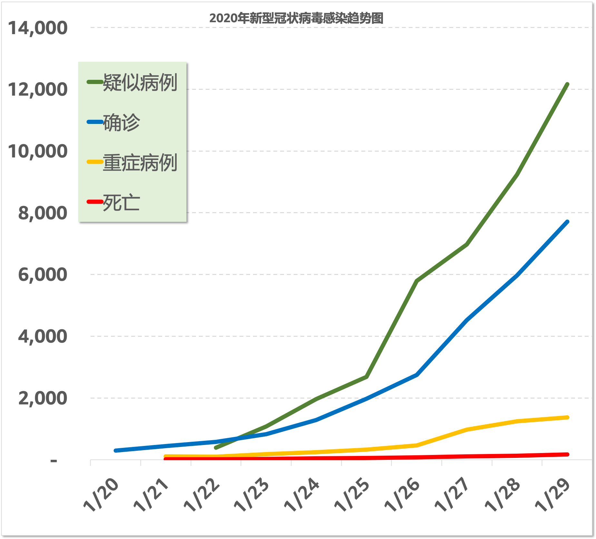

# 武汉疫情日报

## 说明

这是根据卫建委发布的官方数据制作的每日疫情发展趋势图。

- [网页地址](https://zire.github.io/pandemic2020/)
- [Github Repo地址](https://github.com/zire/pandemic2020)
- 数据来源：[中华人民共和国国家卫生健康委员会卫生应急办公室](http://www.nhc.gov.cn/)
- 发布媒体：人民日报微信公共号/官方微博
- 数据统计窗口：每日00 - 24小时
- 数据类型（累计/新增): 累计

## 疫情趋势图

## 统计数据

| 日期 | 密切接触 | 接受医学观察 | 疑似病例 | 确诊 | 重症病例 | 死亡 |
| --- | --- | --- | --- | --- | --- | --- |
| 1/25/2020 | 23,431 | 21,556| 2,684|1,975| 324|56|
|1/24/2020|15,197|13,967|1,965|1,287|237|41|
|1/23/2020|9,507|8,420|1,072|830|177|25|
|1/22/2020|5,897|4,928|393|571|95|17|
|1/21/2020|2,197| 1,394| N.A. |440|102|9|
|1/20/2020|1,739|922|54|291|N.A.|N.A.|

## 数据来源

- [截至1月25日24时新型冠状病毒感染的肺炎疫情最新情况](http://www.nhc.gov.cn/xcs/yqfkdt/202001/9614b05a8cac4ffabac10c4502fe517c.shtml)
- [截至1月24日24时新型冠状病毒感染的肺炎疫情最新情况](http://www.nhc.gov.cn/xcs/yqtb/202001/a7cf0437d1324aed9cc1b890b8ee29e6.shtml)
- [1月23日新型冠状病毒感染的肺炎疫情情况](http://www.nhc.gov.cn/xcs/yqtb/202001/5d19a4f6d3154b9fae328918ed2e3c8a.shtml)
- [1月22日新型冠状病毒感染的肺炎疫情情况](http://www.nhc.gov.cn/xcs/yqtb/202001/a3c8b5144067417889d8760254b1a7ca.shtml)
- [1月21日新型冠状病毒感染的肺炎疫情情况](http://www.nhc.gov.cn/xcs/yqtb/202001/930c021cdd1f46dc832fc27e0cc465c8.shtml)

