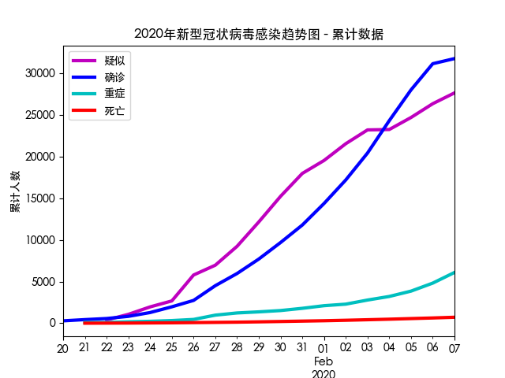
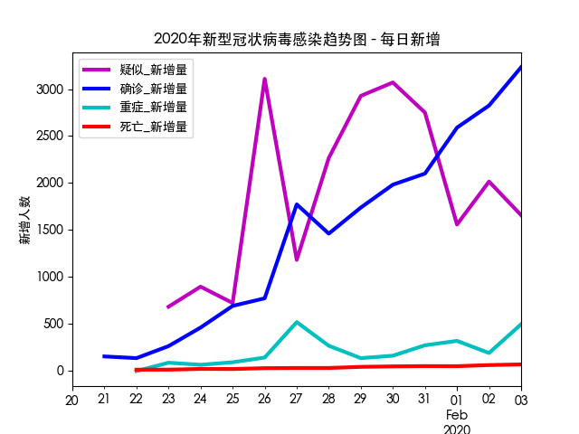
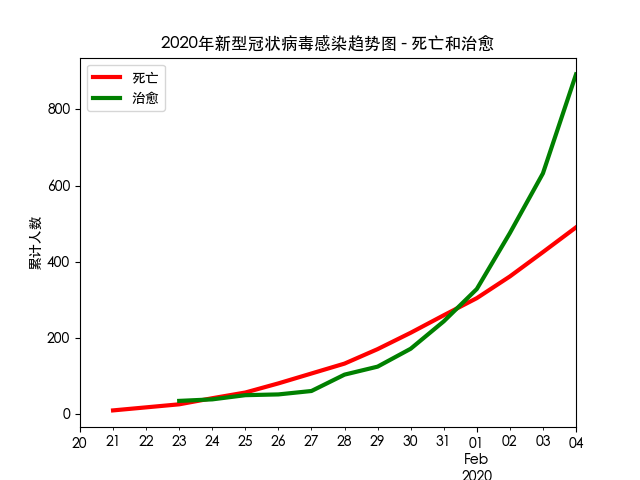

# 2020年新型冠状病毒感染趋势图

## 说明

这是根据卫建委发布的官方数据制作的每日疫情发展趋势图。每日830~930之间根据卫建委发布的最新疫情通报更新。

- 更新时间: **`08:30, 2020-02-02`**
- [网页地址](https://zire.github.io/pandemic2020/)
- [Github Repo地址](https://github.com/zire/pandemic2020)
- 数据来源：[中华人民共和国国家卫生健康委员会卫生应急办公室](http://www.nhc.gov.cn/)
- 数据范围: 全中国
- 数据统计窗口：每日00 - 24小时
- 死亡率 = 当日累计死亡人数/当日累计确诊人数

## 疫情趋势图

历史累计

每日新增

历史累计 - 死亡和治愈

## 统计数据

### 累计

|    |                日期 |   接触 |   观察 |   疑似 |   确诊 |   重症 |   死亡 |   治愈 |
|----|---------------------|--------|--------|--------|-------:|-------:|-------:|-------:|
| 13 | 2020-02-02 00:00:00 | 189583 | 152700 | 21558  |  17205 |   2296 |    361 |    475 |
| 12 | 2020-02-01 00:00:00 | 163844 | 137594 | 19544  |  14380 |   2110 |    304 |    328 |
| 11 | 2020-01-31 00:00:00 | 136987 | 118478 | 17988  |  11791 |   1795 |    259 |    243 |
| 10 | 2020-01-30 00:00:00 | 113579 | 102427 | 15238  |   9692 |   1527 |    213 |    171 |
| 9  | 2020-01-29 00:00:00 | 88693  | 81947  | 12167  |   7711 |   1370 |    170 |    124 |
| 8  | 2020-01-28 00:00:00 | 65537  | 59990  | 9239   |   5974 |   1239 |    132 |    103 |
| 7  | 2020-01-27 00:00:00 | 47833  | 44132  | 6973   |   4515 |    976 |    106 |     60 |
| 6  | 2020-01-26 00:00:00 | 32799  | 30453  | 5794   |   2744 |    461 |     80 |     51 |
| 5  | 2020-01-25 00:00:00 | 23431  | 21556  | 2684   |   1975 |    324 |     56 |     49 |
| 4  | 2020-01-24 00:00:00 | 15197  | 13967  | 1965   |   1287 |    237 |     41 |     38 |
| 3  | 2020-01-23 00:00:00 | 9507   | 8420   | 1072   |    830 |    177 |     25 |     34 |
| 2  | 2020-01-22 00:00:00 | 5897   | 4928   | 393    |    571 |     95 |     17 |    nan |
| 1  | 2020-01-21 00:00:00 | 2197   | 1394   | nan    |    440 |    102 |      9 |    nan |
| 0  | 2020-01-20 00:00:00 | 1739   | 922    | 54     |    291 |    nan |    nan |    nan |

### 当日新增百分比

## 疫情蔓延时应该看什么电影

1. [Contagion (2011), IMDB 6.6, Matt Damon, Jude Law, Kate Winslet, Gwyneth Paltrow](https://www.imdb.com/title/tt1598778/). 这是跟目前的outbreak最接近的电影，几乎一模一样的情节。不要轻易跟厨师握手。
2. [World War Z (2013), IMDB 7.0, Brad Pitt](https://www.imdb.com/title/tt0816711/). 找到疫情源头至关重要，哪怕牺牲再多的海军陆战队员也再所不惜。身上有点小病未必是坏事。
3. [Outbreak (1995), IMDB 6.6, Dustin Hoffman, Rene Susso, Morgan Freeman, Kevin Bacon](https://www.imdb.com/title/tt0114069/). 论病毒的产生跟政府研究生化武器之间的关系。找到原始带菌者（电影里是一只猴子）是培育疫苗的关键。
4. [Train to Busan (2016), IMDB 7.5, Yoo Gong, Ma Dong-seok](https://www.imdb.com/title/tt5700672/). 在人群密集的地方如何保护自己，除了傍上马东锡这样的猛男以外
5. [Zombieland (2009), IMDB 7.6, Emma Stone, Woody Harrelson, Jesse Eisenberg](https://www.imdb.com/title/tt1156398/). 在非常时期里非常实用的求生手册
6. [Zombieland: Double Tap (2019), IMDB 6.8, Woody Harrelson, Jesse Eisenberg, Emma Stone](https://www.imdb.com/title/tt1560220/).在逃难时，四个人是比较合适的MDU (Minimum Deployment Unit）
7. [The Mist (2007), IMDB 7.1, Thomas Jane](https://www.imdb.com/title/tt0884328/). 是待在原地还是外冲？
8. [28 Days Later (2002), IMDB 7.6, Cillian Murphy, Naomie Harris](https://www.imdb.com/title/tt0289043/). 瘟疫横行时，人比病毒更让人恐惧
9. [Perfect Sense (2011), IMDB 7.1, Ewan McGregor, Eva Green](https://www.imdb.com/title/tt1439572/). 现在拥有的各种美好，不是理所当然的。
10. [War of the Worlds (2005), IMDB 6.5, Tom Cruise, Tim Robbins](https://www.imdb.com/title/tt0407304/). 如何开车逃生，以及避开人群的重要性
11. [Shaun of the Dead (2004), Simon Pegg, Nick Frost](https://www.imdb.com/title/tt0365748/). 不管在何种危难关头，都不能抛弃Prince的黑胶, Batman Forever的则可以。
12. [I Am Legend (2007), IMDB 7.2, Will Smith](https://www.imdb.com/title/tt0480249/). 
13. [Twelven Monkeys (1995), IMDB 8.0, Bruce Willis, Brad Pitt, Madeleine Stowe](https://www.imdb.com/title/tt0114746/). 
14. [Children of Men (2006), IMDB 7.9, Clive Owen, Julianne Moore, Chiwetel Ejiofor](https://www.imdb.com/title/tt0206634/).

## 数据来源

- [截至2月2日24时新型冠状病毒感染的肺炎疫情最新情况](http://www.nhc.gov.cn/xcs/yqfkdt/202002/24a796819bf747bd8b945384517e9a51.shtml)
- [截至2月1日24时新型冠状病毒感染的肺炎疫情最新情况](http://www.nhc.gov.cn/xcs/yqtb/202002/d5c495da742f4739b7f99339c3bd032f.shtml)
- [截至1月31日24时新型冠状病毒感染的肺炎疫情最新情况](http://www.nhc.gov.cn/xcs/yqtb/202002/84faf71e096446fdb1ae44939ba5c528.shtml)
- [截至1月30日24时新型冠状病毒感染的肺炎疫情最新情况](http://www.nhc.gov.cn/xcs/yqtb/202001/a53e6df293cc4ff0b5a16ddf7b6b2b31.shtml)
- [截至1月29日24时新型冠状病毒感染的肺炎疫情最新情况](http://www.nhc.gov.cn/xcs/yqtb/202001/e71bd2e7a0824ca69f87bbf1bef2a3c9.shtml)
- [截至1月28日24时新型冠状病毒感染的肺炎疫情最新情况](http://www.nhc.gov.cn/xcs/yqtb/202001/1c259a68d81d40abb939a0781c1fe237.shtml)
- [截至1月27日24时新型冠状病毒感染的肺炎疫情最新情况](http://www.nhc.gov.cn/xcs/yqtb/202001/ec9fe7ea987d467d9462e7db509079e6.shtml)
- [截至1月26日24时新型冠状病毒感染的肺炎疫情最新情况](http://www.nhc.gov.cn/xcs/yqtb/202001/3882fdcdbfdc4b4fa4e3a829b62d518e.shtml)
- [截至1月25日24时新型冠状病毒感染的肺炎疫情最新情况](http://www.nhc.gov.cn/xcs/yqtb/202001/9614b05a8cac4ffabac10c4502fe517c.shtml)
- [截至1月24日24时新型冠状病毒感染的肺炎疫情最新情况](http://www.nhc.gov.cn/xcs/yqtb/202001/a7cf0437d1324aed9cc1b890b8ee29e6.shtml)
- [1月23日新型冠状病毒感染的肺炎疫情情况](http://www.nhc.gov.cn/xcs/yqtb/202001/5d19a4f6d3154b9fae328918ed2e3c8a.shtml)
- [1月22日新型冠状病毒感染的肺炎疫情情况](http://www.nhc.gov.cn/xcs/yqtb/202001/a3c8b5144067417889d8760254b1a7ca.shtml)
- [1月21日新型冠状病毒感染的肺炎疫情情况](http://www.nhc.gov.cn/xcs/yqtb/202001/930c021cdd1f46dc832fc27e0cc465c8.shtml)
